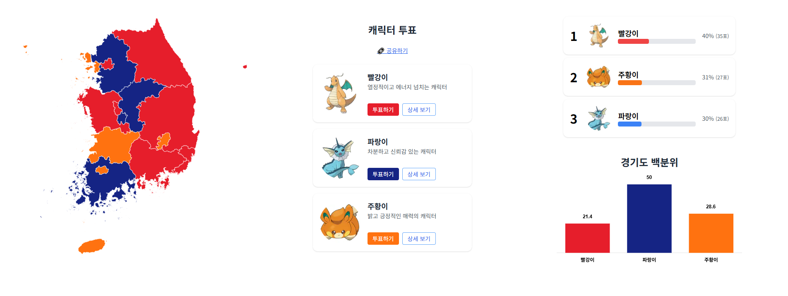

# 🗳️ Mock Election - 캐릭터 인기 투표 웹앱
> 지역별 투표 결과를 실시간으로 확인 가능한 투표 포맷
> 🎮 배포 주소: [votemypresident.kro.kr](https://votemypresident.kro.kr)

---


이 프로젝트는 **Sanrio 캐릭터 총선거** 스타일의 UX를 참고하여 만든,  
**실시간 인기 투표 웹 애플리케이션**입니다.  
Firebase를 백엔드로 사용하고, Next.js + TailwindCSS로 제작되었습니다.



---

## 🚀 주요 기능

### 🗺️ 지역 기반 투표 시각화
- 대한민국 지도 (GeoJSON 기반 SVG)
- 각 도/광역시에 따라 **최다 득표 캐릭터 색상** 반영
- Hover 시 해당 지역의 **득표율 툴팁** 표시

### 🧸 캐릭터 투표
- 3명의 캐릭터 중 하나 선택해 투표 가능
- 투표 시 성별, 연령, 지역을 입력하는 **설문 모달** 등장
- 투표는 Firebase에 실시간 반영

### 📊 결과 시각화
- 전체 투표 결과: 가로 막대그래프 (득표율 %로 표시)
- 선택한 지역의 투표 결과도 **서브 그래프로 실시간 표시**

### 🔥 추가 UX 요소
- 실시간 Firebase 연동 (`onSnapshot`)
- 지역 클릭 시 지도 색상 반영 및 하단 결과 반영
- 반응형 UI / 모바일 최적화

---

## 🛠️ 기술 스택

| Frontend         | Backend / Infra         | 기타                   |
|------------------|--------------------------|------------------------|
| Next.js 15.x     | Firebase Firestore       | TailwindCSS            |
| React.js 18.x    | Firebase SDK (v11)       | Chart.js + react-chartjs-2 |
| TypeScript       |                          | react-simple-maps      |
| Framer Motion    |                          | react-tooltip v5       |

---

## 📁 프로젝트 구조 (중요 디렉토리)

```
mock-election/
├─ src/
│  ├─ app/                # Next.js app 디렉토리
│  ├─ components/         # 재사용 컴포넌트 (지도, 카드, 모달 등)
│  ├─ lib/                # Firebase 로직 (submitVote, vote fetch 등)
│  ├─ hooks/              # custom hooks (지역별 색상 구하기 등)
│  └─ firebase/           # Firebase 초기화
```

---

## 📝 기능 개발 로그 (요약)

- [x] Firebase 연동 및 투표 데이터 구조 설계
- [x] 실시간 `votes/{region}` 문서 구조로 투표 반영
- [x] GeoJSON 지도 렌더링 및 지역별 색상 반영
- [x] 투표 모달 + 설문 입력 UI 구성
- [x] 전체/지역 득표율 계산 로직 구현
- [x] Chart.js로 득표율 막대 그래프 구현
- [x] 반응형 레이아웃 구성 및 모바일 대응

---

## 🧪 실행 방법

1. 이 레포를 클론합니다:

```bash
git clone https://github.com/yourname/mock-election.git
cd mock-election
```

2. 의존성 설치

```bash
npm install
```

3. `.env.local`에 Firebase 환경변수 설정

```env
NEXT_PUBLIC_FIREBASE_API_KEY=...
NEXT_PUBLIC_FIREBASE_AUTH_DOMAIN=...
NEXT_PUBLIC_FIREBASE_PROJECT_ID=...
NEXT_PUBLIC_FIREBASE_APP_ID=...
```

4. 개발 서버 실행

```bash
npm run dev
```

---

## ✅ 향후 개선사항

- [ ] Firebase 인증 기반 중복 투표 방지
- [ ] 애니메이션 효과 (Confetti, 전환 등)
- [ ] 정렬 기준 필터 추가 (예: 연령별 분석)
- [ ] Vercel 또는 Firebase Hosting 배포

---

## 📸 예시 스크린샷

> 전체 지도 기반 시각화 + 실시간 득표 그래프  
> 

---

## 🙌 만든 사람

이 프로젝트는 프론트엔드 + 데이터 시각화 역량 강화를 위해 만들어졌습니다.  
문의 및 피드백 환영합니다! ✉️

```
📛 이재현  
📧 jhleegit@gmail.com  
🌐 https://github.com/jhleegit
```

---

## 📄 라이선스

본 프로젝트는 MIT 라이선스를 따릅니다.
